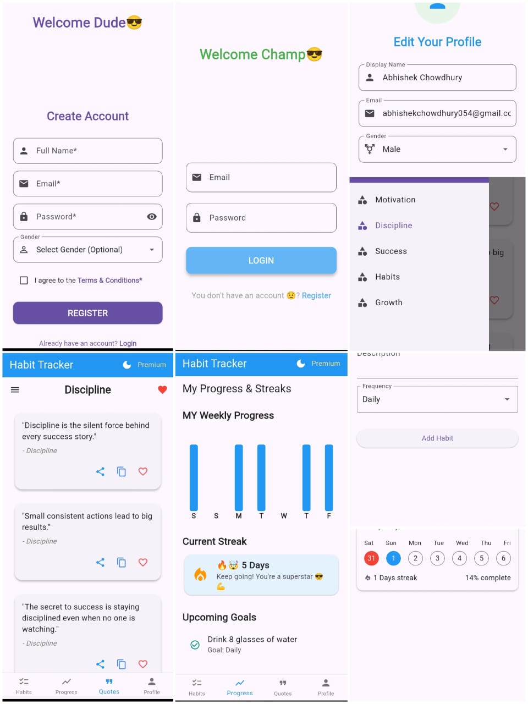
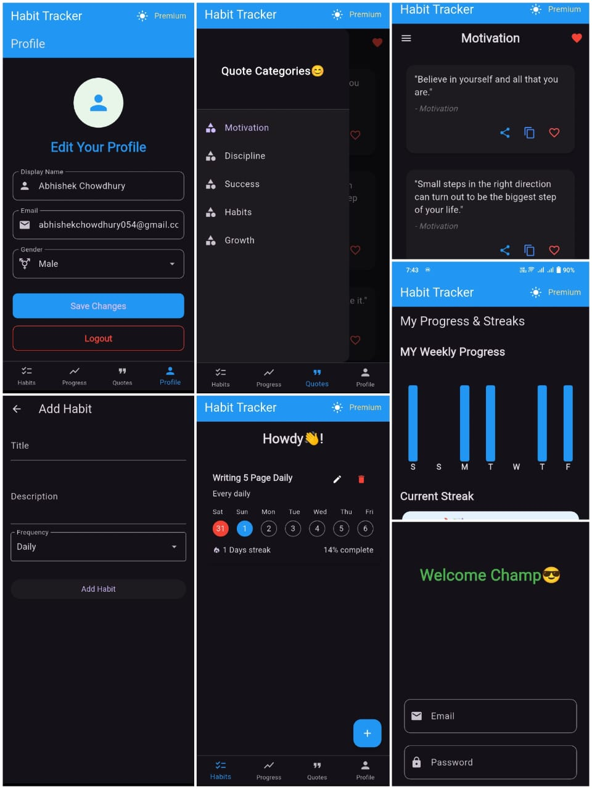

# Habit Tracker App 🕒✅

A **Flutter Habit Tracker App** to help you build consistent habits, track daily routines, and stay motivated with streaks and inspirational quotes.  
Powered by **Firebase**, it supports authentication and cloud storage for your habits.

---

## ✨ Key Features

### 🔑 Authentication
- 📝 Login with email & password
- 📝 Register a new account

### 🏠 Habit Management
- 🏠 Home Page listing all your habits
- ➕ Easily add new habits
- 📊 Track completion percentage and streaks
- 🔥 Display current and longest streaks
- 🗓️ View monthly calendar with completed days highlighted
- 📉 Visualize monthly statistics with graphs

### 💡 Motivation
- 💡 Large collection of quotes, categorized for easy browsing

### 👤 Profile
- 👤 Edit and update your profile anytime

### ☁️ Backend
- Firebase Authentication & Cloud Firestore database

---

## 📸 Screenshots

| Light Mode                      | Dark Mode                     |
|---------------------------------|-------------------------------|
|  |  |

###Firebase
[Firebase_1](assets/Firebase_1.jpg)
[Firebase_2](assets/Firebase_2.jpg)
[Firebase_3](assets/Firebase_3.jpg)
[Firebase_4](assets/Firebase_4.jpg)

---

## 🚀 Getting Started

Follow these steps to get the app running locally:

### 1️⃣ Clone the repository
```bash
git clone https://github.com/Abhishek213-013/HabitTracker.git
cd habittrackingapp
```
### 2️⃣ Install dependencies
flutter pub get

### 3️⃣ Configure Firebase

- Go to Firebase Console
- Create a new Firebase project
- Enable Email/Password Authentication
- Setup Cloud Firestore database

- Android: Place google-services.json in:
- android/app/
- iOS: Place GoogleService-Info.plist in:
- ios/Runner/

### 4️⃣ Run the app
- Connect your emulator or device, then run:
- flutter run

### 5️⃣ (Optional) Build Release Version
- flutter build apk   # Android
- flutter build ios   # iOS

## 📊 Tech Stack

- Frontend: Flutter (Dart)

- Backend: Firebase (Auth & Firestore)

- State Management: Provider

## ❤️ Contributing

- Contributions are welcome! Fork the repo and create a pull request to improve the app.
